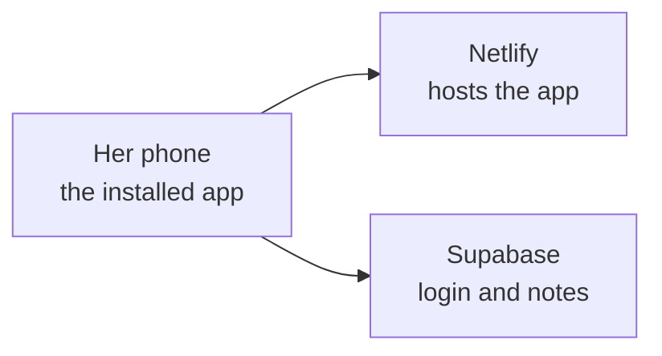
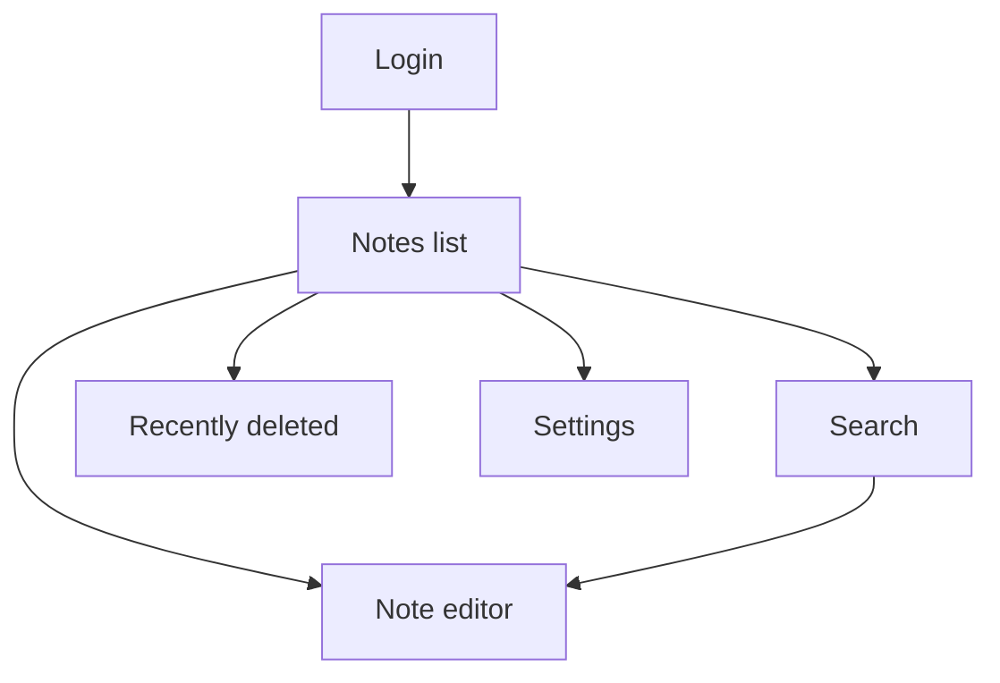

# Notes App Design Blueprint

2026-09-20 · @Someone

## Overview

The app is a website she installs on her phone. She opens it, logs in, and writes. Her notes are stored safely online so they appear on any device.

Three parts make this work:

Netlify shows her the app. Supabase remembers who she is and keeps her notes.

## Tools

| Tool | What it does for you |
| --- | --- |
| GitHub | Stores the code and every change made to it |
| Claude Code | Writes the code from our prompts |
| Next.js | The framework the app is built with |
| Tailwind | Handles colors, fonts and spacing so the design stays consistent |
| Tiptap | The text editor she writes in. Gives bullets, tick boxes and headings |
| Supabase | Login, the notes database and privacy rules |
| Netlify | Puts the app online and updates it after every GitHub change |
| PWA setup | Lets her add the app to her home screen and open it full screen |

## Screen flow

The bottom bar switches between Notes and Search. Recently deleted and Settings are reached from the top of the Notes list.

## Screen blueprints

Each layout is listed from top to bottom.

**Notes list**

1. Top: app name in serif font on the left, small icons for Recently deleted and Settings on the right
2. Pinned notes, if any, under a small "Pinned" label
3. All other notes, newest first, as soft cards. Each card shows the title, a two line preview and the date
4. Round new note button, bottom right, above the bottom bar
5. Bottom bar: Notes and Search

**Note editor**

1. Top: back arrow on the left, "Saved" status and a menu on the right. The menu holds Pin and Delete
2. Large blank writing area with the placeholder text. The first line shows as the title in serif font
3. Above the keyboard: a slim formatting bar with heading, bold, bullet list, numbered list and tick box list

**Search**

1. Search box at the top, active as soon as the screen opens
2. Results as note cards, updating while she types
3. If nothing is found, one calm line of text

**Recently deleted**

1. Back arrow and title
2. Deleted notes as cards with the days left before removal
3. Each card has Restore and Delete forever

**Settings**

1. Her email address
2. Log out button

## Design system

One set of rules that every screen uses, so the app looks the same everywhere.

| Element | Choice |
| --- | --- |
| Background | Off-white, #FAF7F2 |
| Cards | Warm beige, #EFE6DA |
| Lines and dividers | Light beige, #E2D7C8 |
| Text | Soft dark brown, #3A3531 |
| Secondary text | Warm gray, #8A8178 |
| Accent | Muted rose taupe, #C4A69B. New note button and active tab only |
| Heading font | Cormorant Garamond, a soft elegant serif |
| Body font | DM Sans, a simple clean sans |
| Corner roundness | 20px on cards, full round on buttons |
| Shadows | Very light and soft, no hard borders |
| Spacing | 24px around screen edges, 16px between cards |
| Icons | Thin line icons |
| Motion | 200 millisecond fades, nothing bounces |

Reusable pieces, built once and used everywhere: note card, round button, top bar, bottom bar, search box, empty message.

## Database

One table for this release, plus one prepared for later.

**Notes table**

| Field | What it holds |
| --- | --- |
| id | Unique number for the note |
| owner | Which user the note belongs to |
| title | Taken from the first line |
| content | Everything she wrote, including lists and formatting |
| type | Plain note for now. Daily entry later |
| note date | The day the note belongs to |
| pinned | Yes or no |
| created at | When it was made |
| updated at | When it was last changed |
| deleted at | Empty, or the day it was deleted |

**Profile table.** Created empty now and filled at onboarding: name, date of birth, birth time, birth place.

**Privacy rule.** The database only returns a note to its owner. This is set in Supabase itself, so it holds even if the app has a mistake. We test it with two accounts.

## Editor behavior

| Situation | What happens |
| --- | --- |
| She types | The note saves about one second after she stops typing |
| Save status | "Saving" then "Saved" in small gray text at the top |
| First line | Becomes the title in the list. No title box |
| Empty note left behind | Removed automatically |
| Connection drops | Text is kept on the phone and saved when the connection returns |
| Opened on two devices | The most recent change wins |
| Search | Looks through titles and note text in the database, ignoring capital letters |
| Delete | Note moves to Recently deleted. Removed for good after 30 days |

## Build steps

Build in this order. Test each step on your phone before the next one.

| Step | What gets built | How you test it |
| --- | --- | --- |
| 1 | Project files, design rules, colors and fonts | A live page opens on your phone in the new look |
| 2 | Login with email and Google | You can sign up, log in and log out |
| 3 | Notes database with privacy rules | A second account sees none of the first account's notes |
| 4 | Notes list and new note button | You can create a note and see it in the list |
| 5 | Editor with autosave and formatting | Type, close the app, reopen, text is there. Bullets and tick boxes work |
| 6 | Pin, delete and Recently deleted | Deleted note can be restored |
| 7 | Search | A word from an old note is found |
| 8 | Bad connection handling | Turn on airplane mode, write, turn it off, note saves |
| 9 | Installable app and bottom bar | Added to home screen, opens full screen |
| 10 | Final polish against the design rules | Compare every screen with this document |

## Built to grow

These choices in the notes app make later features easy to add.

| Later feature | How it attaches |
| --- | --- |
| Daily entry | A note with type set to daily entry and a note date |
| Four sections | Fixed sections inside the editor: focus card, to-do list, limiting beliefs, end of day journal |
| Focus card | A block at the top of the note, with room already reserved |
| Card images | Added to the focus card block and to the note cards in the list |
| Onboarding | Fills the profile table and starts the first daily entry |
| Placements and transits | Stored against the profile and the day |
| Push notifications | Morning and evening reminders that open today's entry |
| Today tab | A third tab added to the bottom bar |
